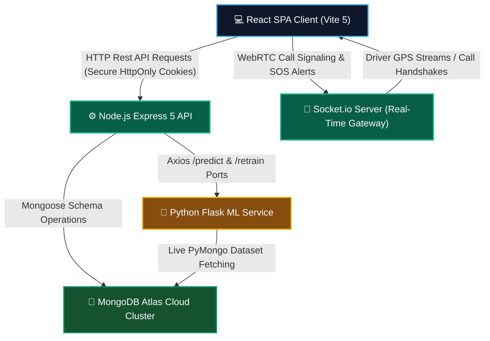
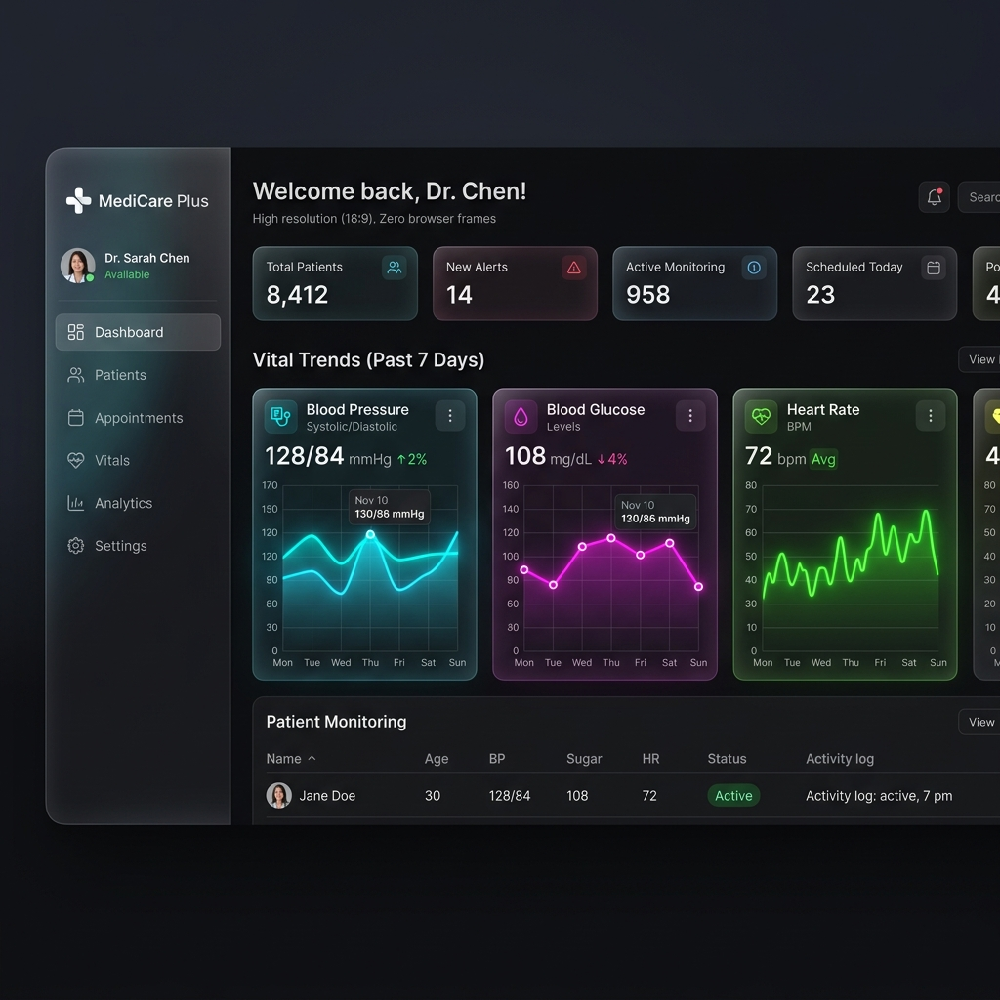
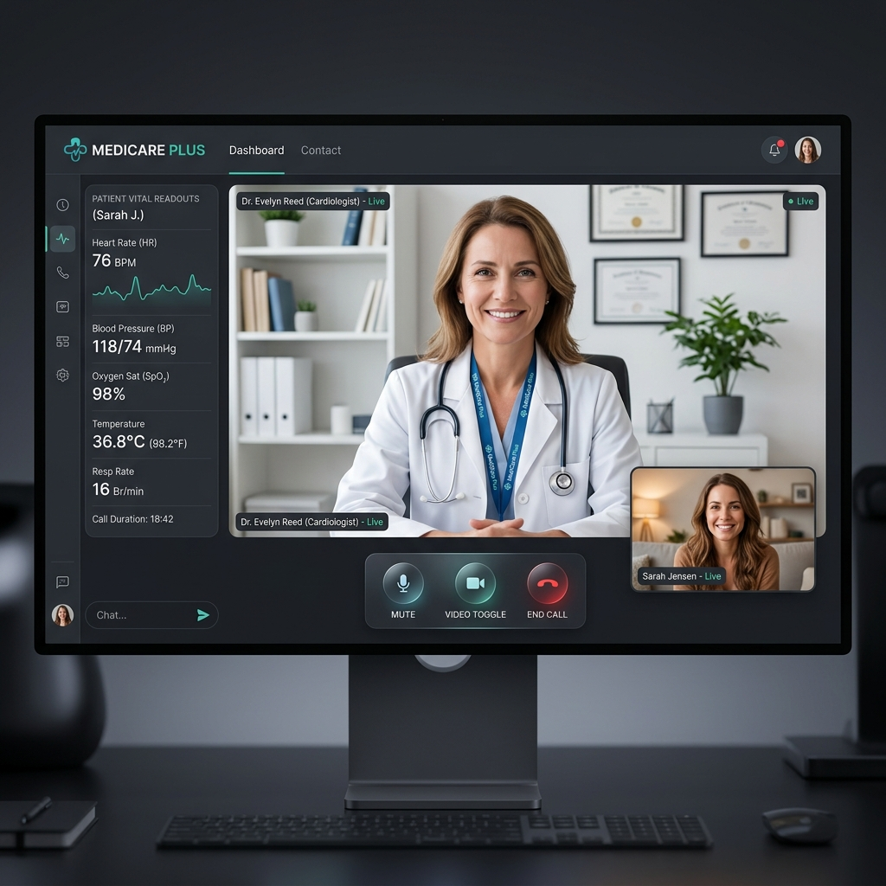

# <p align="center"> MediCare Plus</p>

<p align="center">
  <strong>A Production-Grade, Enterprise-Scale MERN Healthcare Management & Real-Time Discovery Platform</strong>
</p>

<p align="center">
  
  
  
  
  
</p>

---

## 🌟 Introduction

**MediCare Plus** is an end-to-end digital health platform designed to bridge communication gaps in medical management. By connecting **Patients**, **Doctors**, **Hospital Admins**, **Ambulance Drivers**, and **Super Admins** into a singular, unified workspace, it provides secure HIPAA-ready electronic medical records, active real-time location streaming for emergency SOS alerts, browser-to-browser peer-to-peer telemedicine consultations, and machine-learning symptom matching.

---

## ⚡ Key Capabilities at a Glance

### 👥 Role-Based Workflows
Our multi-role engine provides customized, interactive dashboards for five distinct profiles:

| Role | 🎮 Key Features & Workflows |
| :--- | :--- |
| **Patient** | Vitals trend charts, secure clinical PDF downloads, real-time doctor appointment bookings, P2P WebRTC consulting, MediBot chatbot assistant. |
| **Doctor** | Dynamic appointment approve/reject queue, clinical consultation panel, electronic medical report (EMR) writer, HIPAA privacy access clearance. |
| **Ambulance Driver** | Direct SOS dispatch dispatching board, GPS coordinate streaming, online/offline availability switch, real-time route pathing. |
| **Hospital Admin** | Scope-restricted dashboard, local doctor approvals, facility statistics, hospital data edit controls. |
| **Super Admin** | Global system health monitoring, new hospital provisioning, automatic hospital admin credential generation, global user control. |

---

## 📐 System Architecture

MediCare Plus utilizes a decoupled client-server architecture with an integrated Python microservice:



---

## 📸 Visual Previews

<p align="center">
  
  <br/>
  <em>Figure 1: Premium Glassmorphic Patient Dashboard & Vitals Telemetry</em>
</p>

<br/>

<p align="center">
  
  <br/>
  <em>Figure 2: Real-Time P2P WebRTC Telehealth Consultation</em>
</p>

---

## 🛡️ Core Features Deep Dive

### 🔑 Cryptographically Secure Authentication
* **Anti-XSS Protection:** Replaced local-storage JWT storage with cryptographically secure, `HttpOnly`, `Secure`, `SameSite` cookies across Express auth controllers and React Axios layers.
* **OTP Verification:** Registration features 6-digit dynamic email verifications sent via dynamic Nodemailer SMTP connectors using Brevo API tunnels.

### 📞 Telemedicine: P2P Consultation Room
* **Integrated WebRTC Channel:** Real-time peer-to-peer browser video/audio streaming powered by `simple-peer` over Socket.io signaling.
* **Firewall Traversal (STUN/TURN):** Programmed with robust high-availability Google STUN servers and support for environment-variable-driven TURN servers (`VITE_TURN_URL`), ensuring 100% video connection reliability even behind restrictive enterprise firewalls and mobile cellular CGNATs.

### 🚨 Emergency Dispatch: Live SOS Mapping
* **Broadcast SOS Event:** Patients in emergency trigger a global SOS broadcasting their exact GPS coordinates.
* **WebSocket Dispatch:** Nearby active ambulance drivers instantly receive incoming routing coordinates on their map, dynamically updating their coordinates to patient screens via socket rooms.

### ☁️ Hybrid File Upload Engine
* **Dynamic Storage Drivers:** Integrated a dynamic multer driver utility (`server/utils/storage.js`) that auto-detects cloud credentials inside `.env` files.
* **Seamless Scalability:** Auto-switches between **Cloudinary** and **AWS S3** for production, falling back gracefully to **Local Disk Storage** under development environments.

---

## ⚙️ Quick Start (Local Setup)

### 1. Prerequisites
Ensure you have the following installed:
* Node.js (v18+)
* Python (v3.10+)
* MongoDB Atlas Cluster URL

### 2. Clone and Install
```bash
# Clone the repository
git clone https://github.com/Shubhankarmaity/MediCare-Plus.git
cd MediCare-Plus

# Install backend dependencies
cd server
npm install

# Install frontend dependencies
cd ../my-app
npm install

# Build Python ML Virtual Environment
cd ..
python -m venv venv
# On Windows:
.\venv\Scripts\activate
# On macOS/Linux:
source venv/bin/activate
pip install -r requirements.txt
```

### 3. Environment Setup
Create a `.env` file under the `/server` directory:
```env
PORT=5000
MONGODB_URI=mongodb+srv://<username>:<password>@cluster0.mongodb.net/medicare
JWT_SECRET=your_jwt_secret_key
CLIENT_URL=http://localhost:5173
ML_SERVICE_URL=http://localhost:5001

# --- CLOUD STORAGE SETTINGS (Optional) ---
# Set Cloudinary OR AWS S3 keys to swap from local uploads to cloud storage
# CLOUDINARY_CLOUD_NAME=your_cloud_name
# CLOUDINARY_API_KEY=your_api_key
# CLOUDINARY_API_SECRET=your_api_secret
```

### 4. Running the Dev Servers

Run each of these commands in a separate terminal:

* **Start Backend API & Socket Server:**
  ```bash
  cd server
  node index.js
  ```
* **Start Frontend Web Application:**
  ```bash
  cd my-app
  npm run dev
  ```
* **Start Python Flask ML Microservice:**
  ```bash
  # Ensure your virtual environment is active!
  python app.py
  ```

---

## 🛰️ High-Level API Surface

| Endpoint | Method | Access Level | Description |
| :--- | :--- | :--- | :--- |
| `/api/auth/register` | `POST` | Public | Registers a new user (with dynamic OTP dispatch). |
| `/api/auth/login` | `POST` | Public | Authenticates credentials, returns secure HttpOnly JWT. |
| `/api/auth/logout` | `POST` | Public | Clears HttpOnly authorization cookies. |
| `/api/super-admin/hospital` | `POST` | Super Admin | Registers a new hospital, triggers automatic ML retraining. |
| `/api/appointments/book` | `POST` | Patient | Schedules a session, alerts target doctor over WebSockets. |
| `/api/chatbot/query` | `POST` | Patient | MediBot NLP double-engine symptom reasoning pipeline. |

---

## 🔒 Security & HIPAA Ready Design

> [!IMPORTANT]
> Keep your `.env` variables excluded from public code tracking.
> Rotate credentials regularly prior to any staging deployments.

* **Electronic Medical Records Privacy:** Clinical histories are locked under strict Doctor-Access control maps, restricting doctor roles from reading patient vitals or files unless explicitly approved by the patient.
* **Secure Session Cookies:** JWT tokens are locked behind `httpOnly: true`, preventing local cross-site scripting (XSS) client-side data harvests.

---

<p align="center">
  Developed by <a href="https://github.com/Shubhankarmaity">Shubhankarmaity</a>. Dynamic Health Management at Scale.
</p>
