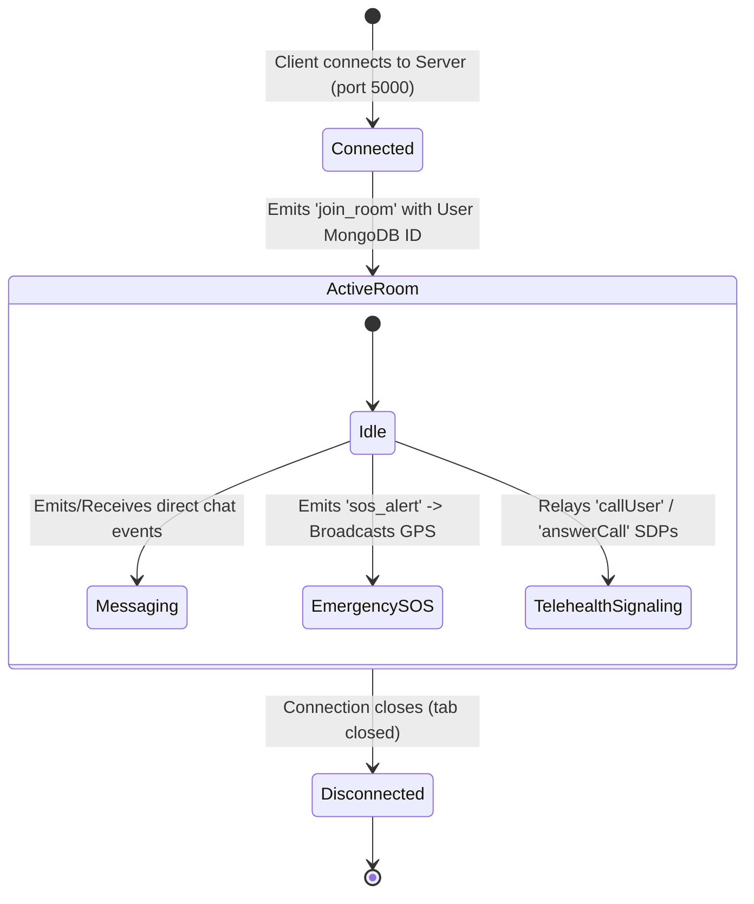
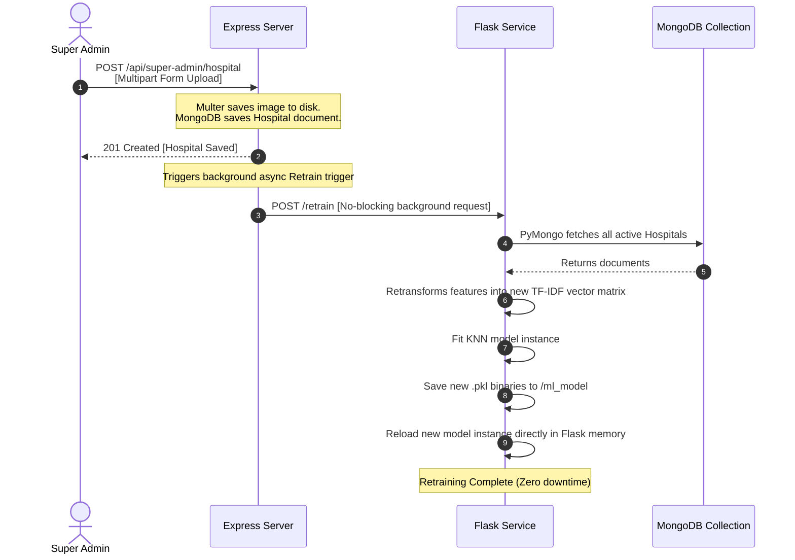

# 🏗️ Architecture Documentation: MediCare Plus

This document provides a deep technical analysis of module responsibilities, service boundaries, request-middleware pipelines, WebSocket states, and the background retraining lifecycle.

---

## 📦 Module Responsibilities

The system enforces clear separation of concerns across the three major processing units:

### 1. The Frontend Client (`/my-app`)
*   **Routing Block (`App.jsx`)**: Declares role-specific SPA route routes, securing views by scanning token strings.
*   **Workflow Dashboards (`src/pages/`)**: Implements specific panels (e.g. `PatientDashboard.jsx`, `DoctorDashboard.jsx`) isolating operational controls.
*   **UI Components (`src/components/`)**: Houses standalone widgets (`PrescriptionManager.jsx`, `MediBot.jsx`, `VideoCall.jsx`) rendering inputs and controlling streams.

### 2. The Backend Server (`/server`)
*   **Server Core (`index.js`)**: Configures Express, mounts CORS and JSON decoders, initializes Socket.io, and boots Mongoose.
*   **Router Boundaries (`routes/`)**: Maps network endpoints directly to target controllers (e.g., routing `/api/vitals` to `vitals.js`).
*   **Controller Operations (`controllers/`)**: Encapsulates business logic: password hashing, verification calculations, appointment state alterations, and NLP matching.
*   **Database Schema Blocks (`models/`)**: Controls ODM model files enforcing data validations and index references.

### 3. The ML Microservice (`/`)
*   **Service Wrapper (`app.py`)**: Hosts Flask REST APIs, cold-starts models into memory, and executes mathematical transformations.
*   **Retrainer Core (`train_model.py`)**: Runs local baseline training workflows using Scikit-Learn libraries.

---

## 🛡️ Express Middleware Pipeline

Every protected REST call traverses a sequential validation chain:

```text
[Incoming HTTP Request]
         │
         ▼
 1. CORS Middleware (Verifies whitelist domain)
         │
         ▼
 2. Express JSON / FormData Decoder (Parses payloads)
         │
         ▼
 3. JWT Auth Middleware (Verifies 'x-auth-token' header)
         ├── [Invalid/Missing] ──▶ Returns 401 / 403 JSON Error
         └── [Valid] ────────────▶ Injects decoded { id, role } to 'req.user'
         │
         ▼
 4. Controller Handler (Coordinates Database / IO operations)
         │
         ▼
[Outgoing HTTP JSON Response]
```

---

## 📡 WebSocket Event & Connection Lifecycle

Sockets are managed using a room-subscription architecture, maximizing notification performance:



*   **Signaling Channel**: When two users start a video call, they utilize Socket.io to route WebRTC session descriptions (SDP) and ICE candidates. Once the browsers acknowledge these packets, the socket drops out of the pathway, and a direct Peer-to-Peer media stream opens between the client browsers.

---

## 🔄 Dynamic ML Retraining Workflow

To avoid system restarts when new hospitals are added by the Super Admin, the backend employs a zero-downtime retraining pipeline:


