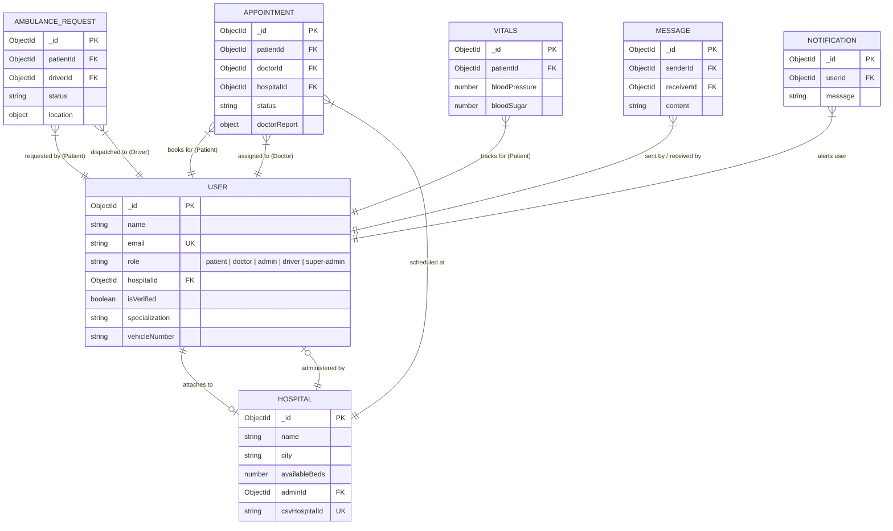

# 🗄️ Database Schema & Data Models: MediCare Plus

This document provides a detailed specification of all database collections, fields, Mongoose schemas, relationships, indexing strategies, normalization choices, and migration protocols.

---

## 🏛️ Schema Overview & Relational Map

MediCare Plus runs on MongoDB, utilizing a moderately normalized NoSQL architecture. Mongoose handles object-document mapping (ODM), enforcing schema validation rules, data defaults, and compound indexes.

---

## 🗂️ Detailed Collection Specifications

### 1. `User` Collection (Unified Schema)
Implements single-table inheritance mapping all five platform roles. Sub-document sets remain undefined depending on role scopes.
*   **Core Fields**:
    *   `name`: String, required, trimmed.
    *   `email`: String, required, unique, lowercased, indexed.
    *   `password`: String, required, `select: false` (shielded from standard queries).
    *   `role`: String, Enum (`'patient'`, `'doctor'`, `'admin'`, `'driver'`, `'super-admin'`), required, indexed.
    *   `isVerified`: Boolean, default `false`.
    *   `otp` / `otpExpires`: String / Date (verification tokens, `select: false`).
    *   `hospitalId`: ObjectId (References `'Hospital'`).
*   **Privacy & Access Fields**:
    *   `privacySettings.profileAccess`: Map of approved doctors:
        *   `approved`: Boolean, default `false`.
        *   `approvedAt`: Date.
        *   `approvedById`: ObjectId (References `'User'`).
        *   `expiresAt`: Date.
        *   `singleUse`: Boolean, default `true`.
        *   `used`: Boolean, default `false`.
    *   `accessRequests`: Map tracking records permission history.
*   **Role-Specific Sub-Fields**:
    *   *Patient*: `bloodGroup` (Enum), `medicalHistory`, `allergies`, `hasMediclaim`, `mediclaimProvider`.
    *   *Doctor*: `specialization`, `experience`, `qualification`, `consultationFee`, `availableDays`, `availableTime`, `licenseNumber`.
    *   *Driver*: `driverLicenseNumber`, `vehicleNumber`, `vehicleType`, `isAvailable` (default `true`), `location` (`{ lat, lng }`).
*   **Indexes**:
    *   `{ email: 1, role: 1 }` (Compound login speed index).

### 2. `Hospital` Collection
Stores extensive detail about facilities, bed states, capacities, insurance networks, and locations.
*   **Key Fields**:
    *   `name`: String, required, trimmed.
    *   `city`: String, required, indexed for fast discovery.
    *   `totalBeds` / `availableBeds`: Number, required.
    *   `icuAvailable`: Boolean (default `false`).
    *   `adminId`: ObjectId (References `'User'`).
    *   `insuranceCompany`: String (comma-separated list of cashless carriers).
    *   `cashlessAvailable`: Boolean (default `false`).
    *   `specialties`: String (comma-separated specialties, e.g. `'Cardiology, Pediatrics'`).
    *   `availableTreatments`: Array of Strings.
    *   `naabhAccredited`: Boolean (default `false`).
    *   `csvHospitalId`: String, unique, sparse (Prevents duplicates when seeding via CSV).

### 3. `Appointment` Collection
Coordinates schedules, clinical visits, and final medical reporting.
*   **Key Fields**:
    *   `patientId` / `doctorId`: ObjectId (References `'User'`), required, indexed.
    *   `hospitalId`: ObjectId (References `'Hospital'`), indexed.
    *   `date`: Date, required, indexed.
    *   `status`: String, Enum (`'requested'`, `'approved'`, `'rejected'`, `'cancelled'`, `'completed'`, `'pending'`), default `'requested'`, indexed.
    *   `symptoms` / `notes`: String, trimmed.
    *   `doctorReport`: Sub-document containing diagnosis, prescription, severity (Enum: `'Low'`, `'Medium'`, `'High'`, `'Critical'`), dosage, and followUpDate.
*   **Indexes**:
    *   `{ doctorId: 1, status: 1 }` (Optimizes active queue dashboards).
    *   `{ patientId: 1, createdAt: -1 }` (Sorts patient timelines).
    *   `{ hospitalId: 1, status: 1 }` (Powers hospital-wide metrics).

### 4. `AmbulanceRequest` Collection
*   **Key Fields**:
    *   `patientId`: ObjectId (References `'User'`), required.
    *   `driverId`: ObjectId (References `'User'`).
    *   `status`: String, Enum (`'pending'`, `'dispatched'`, `'arrived'`, `'completed'`, `'cancelled'`), default `'pending'`.
    *   `location`: `{ lat, lng }` (Current pickup coordinates).

### 5. `Vitals` Collection
*   **Key Fields**:
    *   `patientId`: ObjectId (References `'User'`), required, indexed.
    *   `systolic` / `diastolic` / `bloodSugar` / `heartRate` / `weight`: Number.
    *   `recordedAt`: Date, default `Date.now`.

### 6. `Message` Collection
*   **Key Fields**:
    *   `senderId` / `receiverId`: ObjectId (References `'User'`), required.
    *   `content`: String, required.
    *   `isRead`: Boolean, default `false`.

---

## ⚡ Performance & Normalization Tradeoffs

1.  **Unified User Collection Strategy**:
    *   *Tradeoff*: Having doctors, patients, and admins in one collection results in sparse document tables (e.g. patients leave specialization fields undefined).
    *   *Benefit*: Highly performant. Authenticating requests is a simple `User.findOne({ email })` query. Standard mongoose populates on appointments (`.populate('patientId')`, `.populate('doctorId')`) bypass slow, multi-collection pipelines.
2.  **Denormalization Choices**:
    *   *Hospital Specialties*: Hospital specialties are stored as comma-separated strings rather than an array of sub-documents. This enables fast, wild-card string regex lookups and simplifies ML feature profile vectorization.

---

## ⚠️ Schema Risks & Missing Indexes

1.  **Ambulance Requests Coordinates**:
    *   *Risk*: Geospatial searches are executed using standard floats (`lat`/`lng`). If search density scales, the database will suffer from slow queries.
    *   *Resolution*: Refactor location coordinates to GeoJSON (`2dsphere` index) to leverage MongoDB's geospatial querying.
2.  **Unindexed Direct Chat Messages**:
    *   *Risk*: In `/api/messages`, conversation histories are retrieved using `{ $or: [{ senderId, receiverId }, { senderId: receiverId, receiverId: senderId }] }`. Currently, there is no compound index covering these sender/receiver queries.
    *   *Resolution*: Add compound indexes `{ senderId: 1, receiverId: 1 }` to secure fast message loading times under load.
