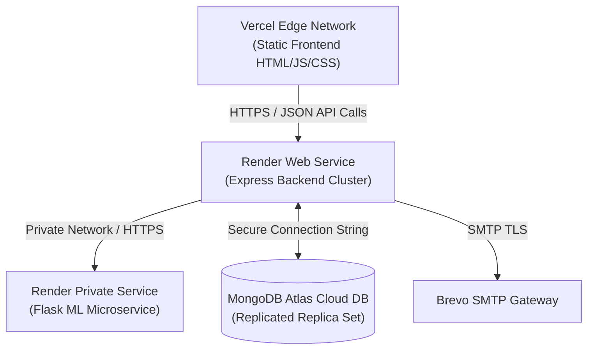

# 🌐 Production Deployment Architecture: MediCare Plus

This document describes the production hosting environment, continuous integration pipelines, deployment steps, and container scaling strategies for MediCare Plus.

---

## 🏛️ Deployment Topology

MediCare Plus is deployed across three core cloud infrastructures:



---

## 🚀 Environment-Specific Configurations

### 1. Frontend: Vercel CDN
*   **Settings**: Vite automatically compiles code to static single-page assets inside the `/dist` folder during builds.
*   **Variables**:
    *   `VITE_API_URL`: Set to your production Express server domain (e.g., `https://api.medicareplus.com`).
    *   `VITE_SOCKET_URL`: Set to your production Express server domain (Socket.io maps events over the same URL).

### 2. Backend: Render Web Service
*   **Settings**: Deploy as a Node.js dynamic web service. Ensure the build command is set to `npm install` and start is set to `node index.js`.
*   **Variables**:
    *   `PORT`: `5000` (Assigned dynamically by Render).
    *   `MONGODB_URI`: Production connection string to a replicated Atlas replica set.
    *   `JWT_SECRET`: Random 256-bit cryptographically secure string.
    *   `CLIENT_URL`: `https://medi-care-plus-gules.vercel.app` (Whitelists your Vercel edge domain).
    *   `ML_SERVICE_URL`: `http://ml-service:5001` (Internal private URL if hosted inside the same Render private network).
    *   `BREVO_API_KEY`: Production Brevo SMTP secret key.

### 3. Machine Learning: Render Web Service
*   **Settings**: Deploy as a Python dynamic service. Establish the build command as `pip install -r requirements.txt` and start command as `gunicorn -b 0.0.0.0:5001 app:app`.
*   **Variables**:
    *   `MONGODB_URI`: Connection string (Used during background `/retrain` loops to read fresh hospital lists).

---

## 🔄 Deployment Order Matrix

To ensure zero-downtime deployment pipelines, follow this sequence:

```mermaid
grid
    1. Deploy MongoDB Atlas Cluster
    2. Import/Seed baseline CSVs or collection tables
    3. Deploy Flask ML Private Service (Ensures /predict and /retrain are active)
    4. Deploy Express Backend Server (Establishes connection to DB and ML endpoints)
    5. Deploy React Client SPA to Vercel (Points to the active Express endpoint)
```

---

## 🐳 Scaling & Dockerization

For high-capacity environments (e.g. AWS ECS, GCP Cloud Run, or Kubernetes), pack the services into separate containers:

### 1. Backend Dockerfile (`/server/Dockerfile`)
```dockerfile
FROM node:18-alpine
WORKDIR /app
COPY package*.json ./
RUN npm ci --only=production
COPY . .
EXPOSE 5000
CMD ["node", "index.js"]
```

### 2. ML Service Dockerfile (`/Dockerfile`)
```dockerfile
FROM python:3.10-slim
WORKDIR /app
COPY requirements.txt .
RUN pip install --no-cache-dir -r requirements.txt
COPY . .
RUN python train_model.py
EXPOSE 5001
CMD ["gunicorn", "-b", "0.0.0.0:5001", "app:app"]
```

---

## 🔒 Production Security Protocols

1.  **SSL/TLS Certificates**: Render and Vercel enforce automated HTTPS redirects via Let's Encrypt certificates. Ensure all API calls route over `https://` protocols.
2.  **XSS Token Security**: As discussed in technical debt, transition the React client from storing token strings in `localStorage` to **HTTP-Only, Secure, SameSite** cookie headers to eliminate script injection vector exposures.
3.  **Cross-Origin Configuration (CORS)**: Set your Express `cors` origin dynamically in production rather than accepting all connections. Reject wildcard origins.
4.  **Static Upload Files Isolation**: Local disk uploads via Multer are lost during server restarts. Swapping this to an **AWS S3** bucket mapped to a cloudfront CDN secures durable storage and speeds up asset delivery.
