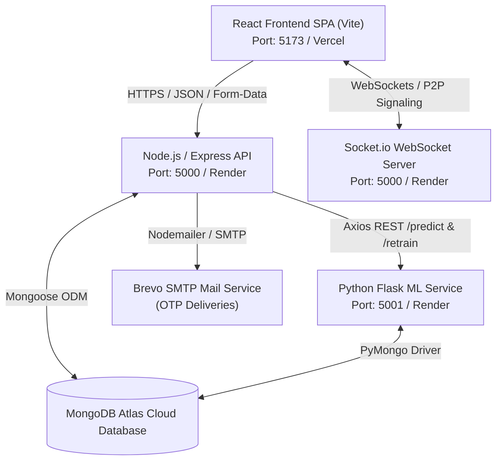
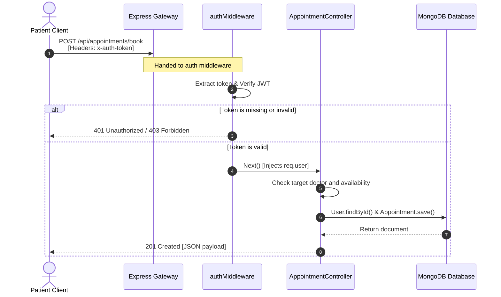
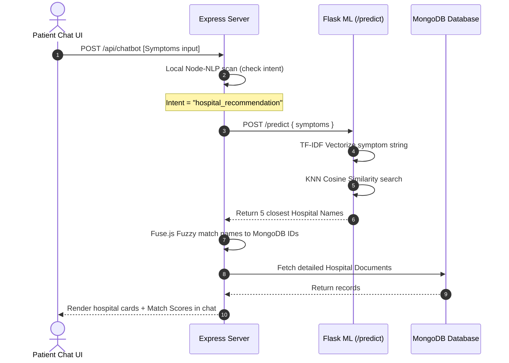

# 🗺️ System Overview: MediCare Plus

This document describes the high-level system-wide topology, database connections, ML integrations, external APIs, and routing structures.

---

## 🏛️ System Topology

MediCare Plus is structured as a decoupled multi-service platform. It comprises a Single Page React application, a central Node.js REST + WebSocket server, a Python Flask machine learning server, a MongoDB database layer, and external SMTP services.

---

## 📡 Core System Services

### 1. React Frontend Client (`/my-app`)
*   **Role**: Handles user experience, routes views, tracks state, and coordinates streams.
*   **Key Packages**: `@mui/material` (UI theme structure), `tailwindcss` (custom views), `recharts` (health metrics rendering), `simple-peer` (WebRTC P2P handler), `socket.io-client` (WebSocket streams), `jsPDF` (clinical export triggers).
*   **State Store**: Employs synchronous local storage vectors (`localStorage`) to preserve JWT authorization headers and user role JSON fields.

### 2. Node.js Express API Server (`/server`)
*   **Role**: Coordinates business logic, manages user collections, and routes API requests.
*   **Key Packages**: `express` (routing layers), `mongoose` (data schemas), `multer` (multipart forms file uploads), `nodemailer` (SMTP connections), `node-nlp` (local intent processing), `jsonwebtoken` (session encryption).

### 3. Socket.io WebSockets Gateway (`/server`)
*   **Role**: Manages persistent bi-directional communication channels.
*   **Key Channels**:
    *   `join_room`: Registers user IDs to isolated virtual channels to route direct, private messages.
    *   `callUser` / `answerCall` / `ice-candidate`: WebRTC signaling transport.
    *   `sos_alert` / `dispatch_ambulance`: Coordinates emergency location broadcasts.

### 4. Flask Python ML Service (`/`)
*   **Role**: Coordinates NearestNeighbors predictions and processes dynamic, zero-downtime model retrains.
*   **Key Packages**: `Flask` (server skeleton), `scikit-learn` (vectorization and similarity calculations), `pandas` & `numpy` (matrix processing), `joblib` (in-memory pipeline loading), `pymongo` (MongoDB connectivity).

---

## 🔐 System Authentication & Request Lifecycle

Below is the procedural flow of a protected REST API call:

---

## 🤖 AI Referral & Prediction Data Flow

The following sequence describes the integration pathway of symptom-based hospital matching:

