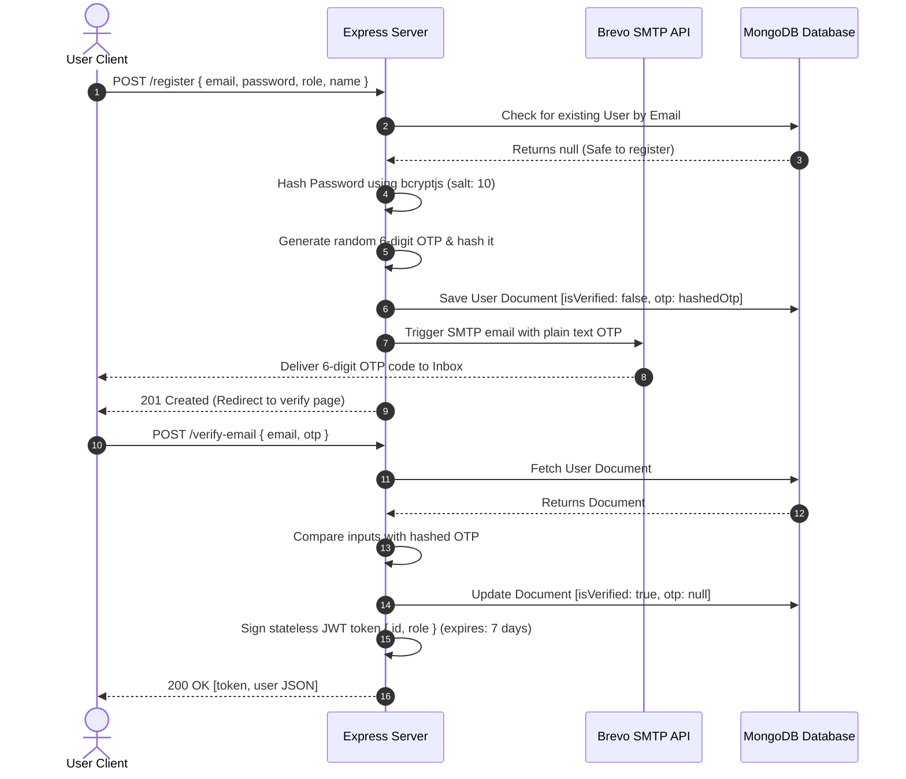
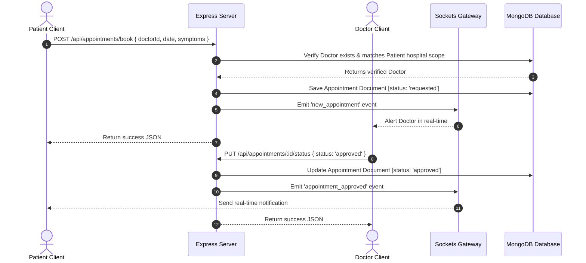
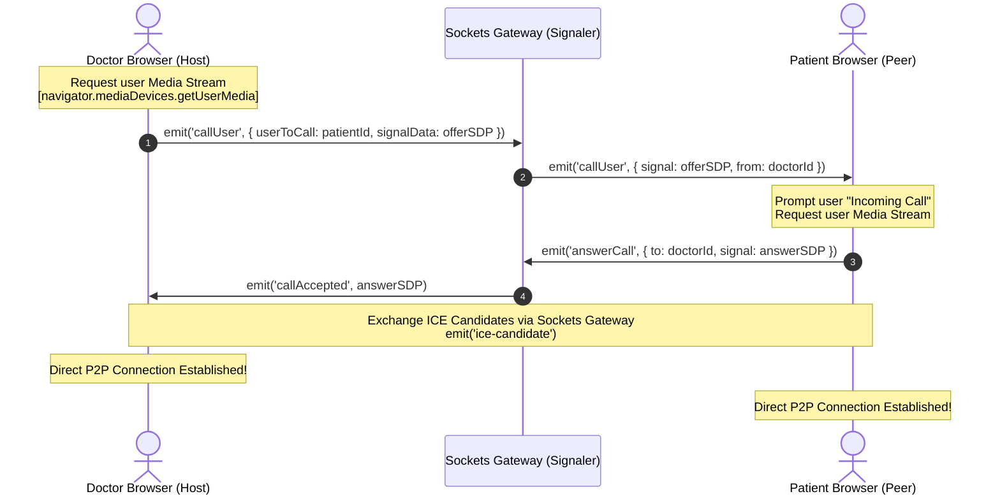
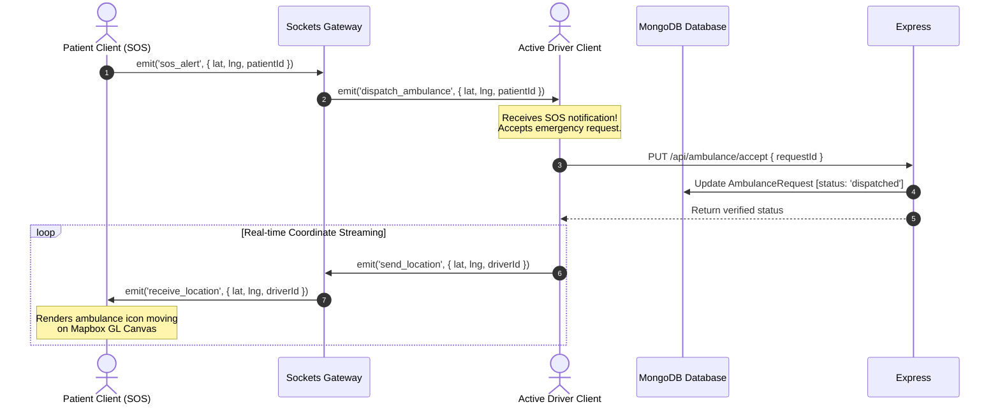
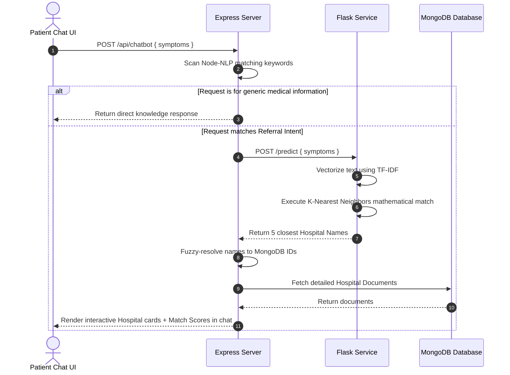

# 🔄 System Workflows: MediCare Plus

This document describes the end-to-end procedural flows of core platform operations, utilizing sequence diagrams to trace client-server-database lifecycles.

---

## 🔐 1. Authentication & Verification Workflow

Enforces registration, password cryptology, OTP email delivery, and JWT creation:

---

## 📅 2. Appointment Booking Lifecycle

A multi-stage coordination pipeline between patients, hospital administrators, and doctors:

---

## 📹 3. WebRTC Video Consultation signaling Flow

Establishes a Peer-to-Peer browser video/audio connection without traversing backend resource pipelines:

---

## 🚨 4. Emergency SOS Ambulance Dispatch Workflow

Establishes live tracking coordinates between a distress call and on-duty ambulance drivers:

---

## 🧠 5. AI Chatbot Inference & Dynamic Recommendation

Combines general health inquiries with dynamic, ML-powered hospital recommendations:

