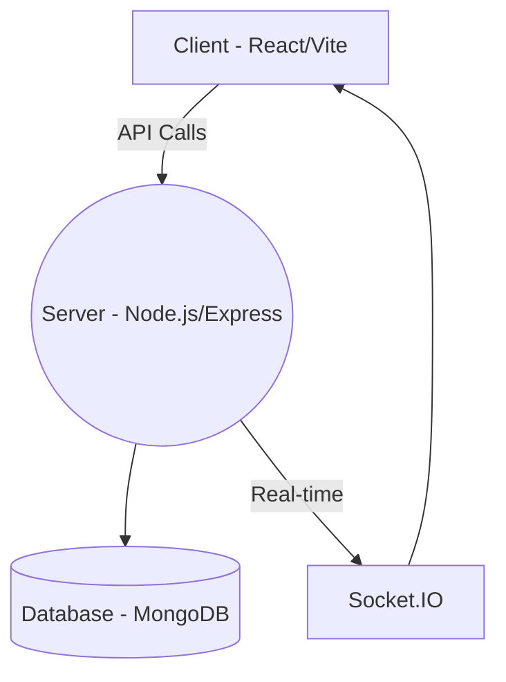
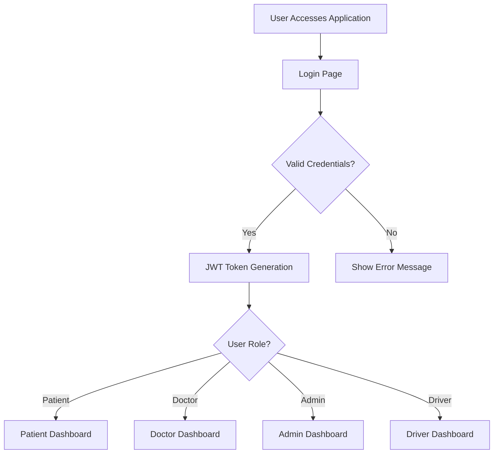
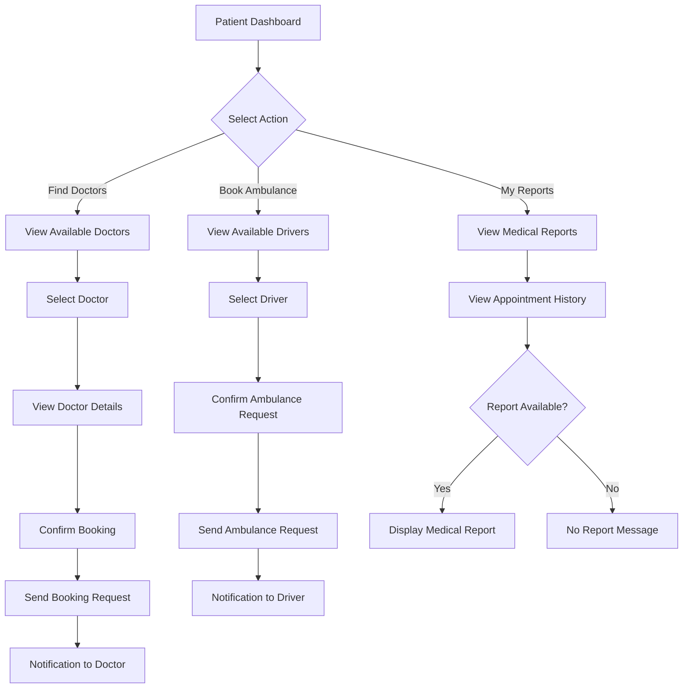
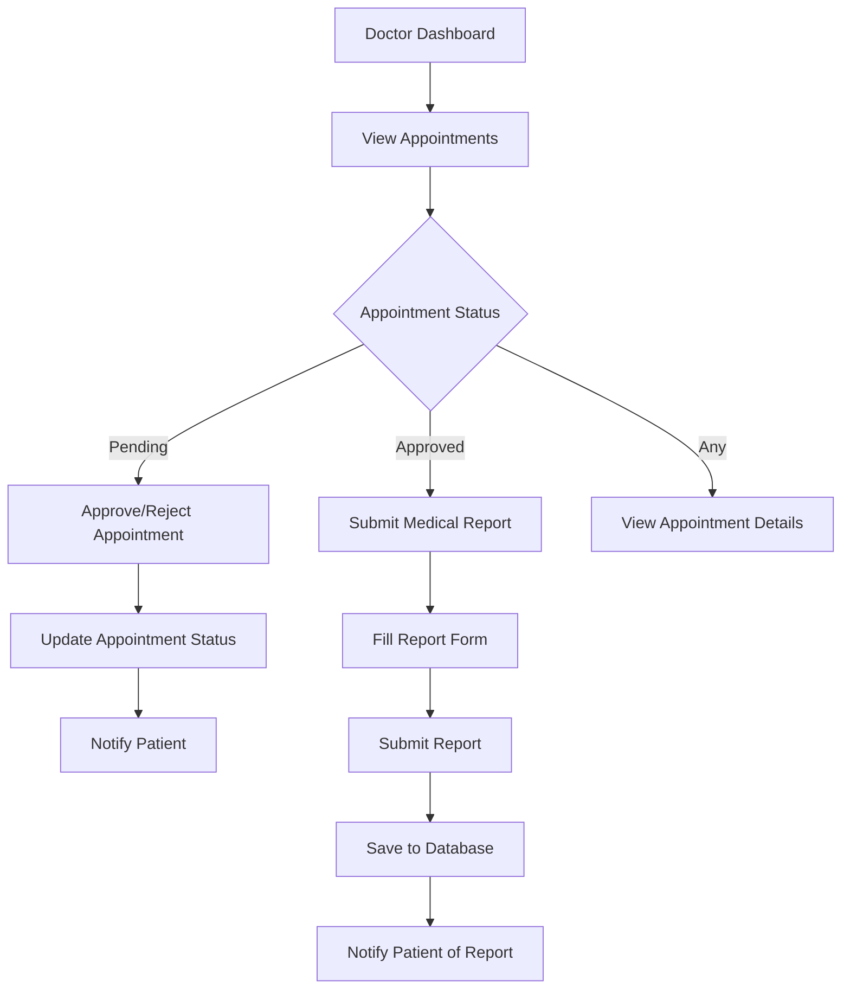
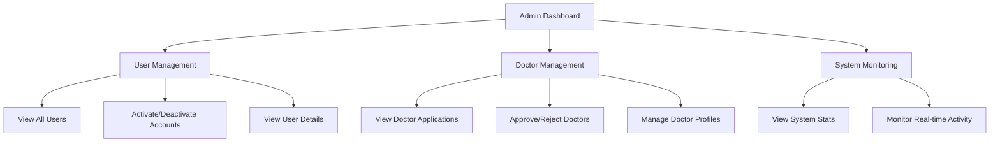
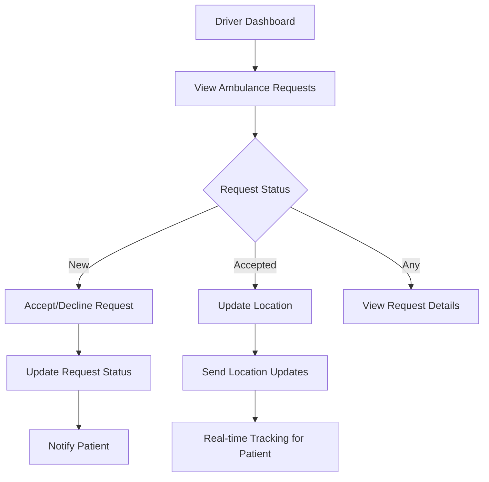
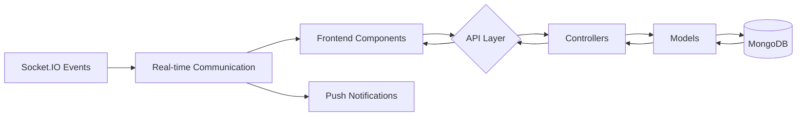
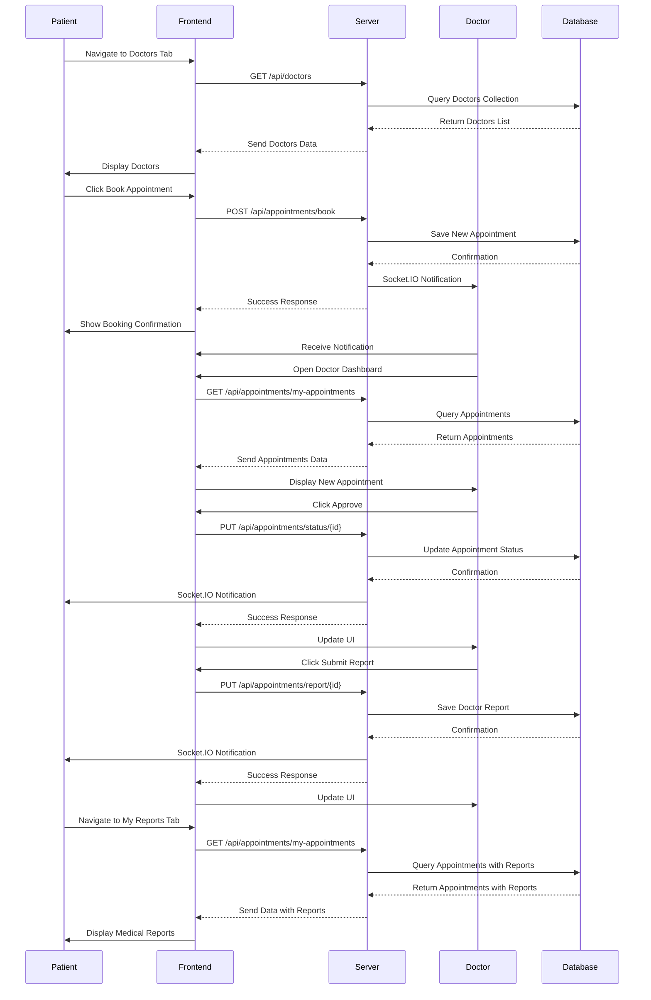

# MediCare-Plus Hospital Management System - Workflow Diagram

## System Architecture Overview

## User Authentication Flow

## Patient Workflow

## Doctor Workflow

## Admin Workflow

## Driver Workflow

## Data Flow Diagram

## Detailed Appointment Process Flow

## Key Features Summary

1. **Role-Based Access Control**
   - Patients: Book appointments, view reports, request ambulances
   - Doctors: Manage appointments, submit reports
   - Admins: User management, system oversight
   - Drivers: Respond to ambulance requests

2. **Real-time Features**
   - Instant notifications via Socket.IO
   - Live ambulance tracking
   - Real-time appointment updates

3. **Data Management**
   - Secure JWT authentication
   - MongoDB for data persistence
   - RESTful API architecture

4. **User Experience**
   - Responsive dashboard layouts
   - Intuitive navigation
   - Visual indicators for status updates